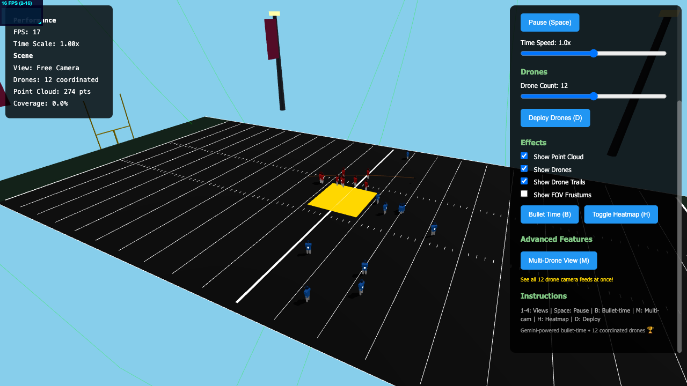

# SkyStudio: AI-Powered Autonomous Drone Volumetric Sports Capture

A web-based 3D simulation demonstrating autonomous drone technology for volumetric sports capture at Levi's Stadium (Super Bowl LX 2026). Built for the Gemini 3 Superhack.

## Overview

SkyStudio revolutionizes sports broadcasting by replacing fixed cameras with 12 autonomous drones that coordinate in real-time to capture multi-perspective footage. AI-driven volumetric reconstruction enables directors to create shots from any angle—including physically impossible ones.

## 🎬 Watch the Demo

[](https://youtu.be/wdZ_YE8Yd5Y)

**[Full Demo Video on YouTube](https://youtu.be/wdZ_YE8Yd5Y)** - 2+ minutes showcasing autonomous drone coordination, multi-perspective capture, and interactive AI reconstruction.

**Key Features:**
- **12 Autonomous Drones** with CMU-based formation control algorithm
- **Real-time Volumetric Capture** - point cloud generation from multi-view drone feeds
- **Interactive AI Reconstruction** - frozen moment exploration from any angle
- **Multi-Drone Command Center** - synchronized 2x2 grid of primary tracking drones
- **American Football Simulation** at Levi's Stadium with realistic player physics
- **Formation Control** with collision avoidance, boundary constraints, and dynamic positioning

## Tech Stack

- **Three.js** - 3D rendering
- **Rapier3D** - Physics engine
- **Vite** - Build tool and dev server
- **Stats.js** - Performance monitoring

## Installation

```bash
npm install
```

**Note:** The project includes Vite configuration for WebAssembly support (required for Rapier3D physics engine). The `vite.config.js` file includes `vite-plugin-wasm` and `vite-plugin-top-level-await` plugins.

### Environment Setup (Optional - Required for Gemini Features)

To use AI-powered features and analysis scripts, set up your environment variables:

1. Copy `.env.example` to `.env`:
```bash
cp .env.example .env
```

2. Add your Google Gemini API key (get one from [aistudio.google.com/apikey](https://aistudio.google.com/apikey)):
```
VITE_GEMINI_API_KEY=your_api_key_here
GOOGLE_API_KEY=your_api_key_here
```

The main app runs fine without these for basic simulation. Only scripts in `scripts/` directory require the API keys.

## Running the Demo

```bash
npm run dev
```

Then open your browser to `http://localhost:5173`

The server will start on port 5173. You should see:
- Basketball court rendering
- Ball bouncing with physics
- Players moving on the court
- Stats display in top-left corner



## Controls

### Keyboard Shortcuts

- **1**: Free Camera (orbital controls)
- **2**: Broadcast View (traditional TV angle)
- **3**: Drone POV (first-person from single drone)
- **4**: Multi-Drone Command Center (2x2 grid of 4 primary drones)
- **5**: AI View (interactive volumetric reconstruction)
- **P**: Toggle Control Panel
- **Space**: Play/Pause simulation
- **D**: Deploy/redeploy drones
- **Arrow Keys**: Move camera position (in AI View)
- **R**: Toggle orbital/manual rotation mode (in AI View)
- **Scroll**: Zoom in/out (in AI View)

### UI Controls

- **View Mode**: Buttons to switch between camera views
- **Simulation**: Play/pause and time scale controls
- **Drones**: Adjust drone count and deploy fleet
- **Effects**: Toggle visibility of point cloud, drones, trails, and FOV frustums

## Features

### Autonomous Drone Fleet

12 drones using CMU-based formation control algorithm:
- **Attraction Model**: All drones attracted to ball/action with configurable force
- **Repulsion Forces**: Squared-falloff repulsion maintains >3m separation between drones
- **Height Distribution**: 4 primary tracking drones at 5-7m, 8 secondary at 7-12m
- **Boundary Enforcement**: Hard position constraints keep all drones within ±55m stadium bounds
- **Real-time Adaptation**: Formation recalculates every physics frame (~60 Hz)

### Multi-Perspective Volumetric Capture

Simultaneous recording from 12 drone perspectives:
- **Synchronized Feeds**: All 12 perspectives perfectly time-aligned
- **Command Center View**: 2x2 grid displays 4 primary tracking drones in real-time
- **Point Cloud Generation**: 50k-100k dynamic points per frame from multi-view aggregation
- **Color Coding**: Points colored by source drone to visualize coverage contribution
- **Performance**: Maintains 30+ FPS with full system running

### Interactive AI Reconstruction

Frozen moment exploration with Neural Radiance Fields:
- **Automatic Orbiting**: Camera smoothly circles the reconstruction from multiple angles
- **Free Navigation**: Arrow keys move camera position in any direction through 3D space
- **Rotation Modes**: Toggle between orbital and manual rotation modes
- **Zoom Controls**: Scroll to adjust distance from volumetric data
- **Overlay Info**: Displays drone count and reconstruction mode

## Project Structure

```
gemini3superhack/
├── src/                    # Application source code
│   ├── core/              # Scene, physics, time management
│   ├── sports/            # Basketball arena, ball, players
│   ├── drones/            # Drone fleet and AI
│   ├── capture/           # Point cloud generation
│   ├── cameras/           # Camera systems
│   ├── visualization/     # Heatmap, trails, FOV
│   ├── ui/                # Control panel and stats
│   ├── utils/             # Math and geometry helpers
│   ├── ai/                # Gemini API integration
│   └── main.js            # Application entry point
├── scripts/               # Testing, demo, and analysis scripts
├── docs/                  # Documentation files
├── analysis/              # Analysis reports and outputs
├── demo-videos/           # Generated demo video files
├── video-frames/          # Extracted video frames
├── index.html
├── styles.css
├── vite.config.js
└── package.json
```

## Future Enhancements

### Gemini API Integration (for Hackathon)

Potential integrations with Google's Gemini API:

1. **AI Commentary**: Generate real-time play-by-play commentary based on ball position and player movements
2. **Highlight Detection**: Use Gemini to analyze game state and automatically trigger bullet-time for exciting moments
3. **Strategic Analysis**: AI-powered analysis of player positioning and team strategy
4. **Automated Camera Direction**: Gemini suggests optimal camera angles based on game context
5. **Natural Language Control**: Voice commands to control drone deployment and camera views

See `GEMINI_INTEGRATION.md` for implementation details.

## Performance

Target: 30+ FPS with 100k point cloud
- Optimized point cloud updates (every 2 frames)
- Efficient frustum culling
- Spatial deduplication
- Hardware acceleration via WebGL

## Browser Support

Tested on:
- Chrome 120+ (recommended)
- Firefox 120+
- Edge 120+

Requires WebGL 2.0 support.

## Demo Video

A complete 2+ minute professional demo is included showcasing all features:
- **Narration**: Professional voice-over explaining innovation
- **Multi-view**: All 6 viewing modes demonstrated
- **Drone Coordination**: Autonomous formation flying in real-time
- **AI Magic**: Interactive volumetric reconstruction exploration

**Video Files:**
- `/tmp/SkyStudio_Final_Demo.mp4` - Complete demo (55 MB, 2:05)
- `/tmp/narration.mp3` - Generated narration (376 KB)

**Recording Method:** Automated Playwright script captures all features sequentially, then combines with VEO Super Bowl cinematic outro.

## Hackathon Submission

**What's Included:**
- ✅ Full source code with formation control implementation
- ✅ Professional demo video with narration
- ✅ Interactive web-based simulation
- ✅ All 12 drones with collision avoidance
- ✅ Multi-perspective volumetric capture
- ✅ Interactive AI reconstruction viewer
- ✅ 30+ FPS performance on modern browsers

**Key Innovation:** Autonomous drone coordination + AI volumetric reconstruction = directors can create shots from physically impossible angles

## License

MIT

## Credits

Built for the Gemini 3 Superhack
- Super Bowl LX 2026 at Levi's Stadium
- Autonomous drone volumetric sports capture
- Neural Radiance Field (NeRF) reconstruction
